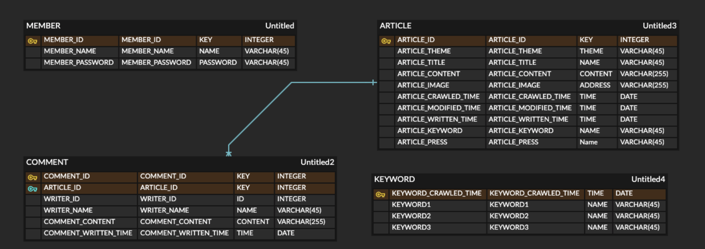
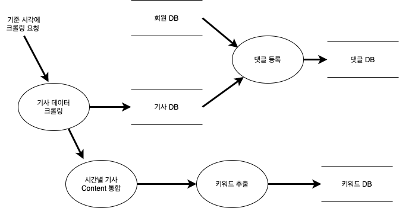

# UnlonePlay
시간별 메인 뉴스 기사 크롤링 프로젝트 

## 프로젝트 개요 
- 매일 8시, 12시, 16시, 20시에 주요 언론사 메인 뉴스 기사 크롤링 
- 게시판 형식을 통한 이전 기사 조회 
- 각 기사마다의 댓글 기능 
- 각 기준시, 분야별로 기사들의 내용들에서 주요 키워드를 추출하여 출력 

## 개발 기간 
2020.08.14 ~ 

## 개발 환경
- Spring Framework
- JSP 
- JdbcTemplate
- Jsoup Ver 1.8

## UI 설계 
https://ovenapp.io/project/5OynNXUcj3cSB0qA0f8oUR9fFb5FJhIh#sAx3W

## 데이터 설계 
### ERD

### DFD (Data Flow Diagram)

